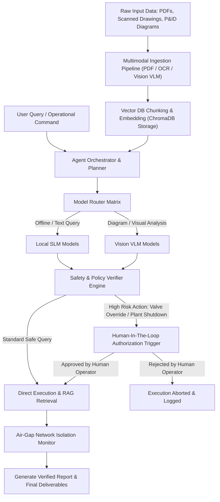

# Kavach AI

An autonomous, air-gapped multimodal AI agent system engineered for industrial safety, plant operations, document ingestion, vector retrieval, and human-in-the-loop operational verification.

---

## Executive Summary

### Problem Statement
Critical infrastructure, industrial plants, energy facilities, and government defense organizations operate under strict security boundaries where standard public cloud LLMs cannot be used due to severe data leakage risks, lack of domain-specific industrial safety compliance, absence of air-gap network enforcement, and lack of deterministic operational verification before executing high-risk commands.

### Solution
Kavach AI provides a zero-leakage, air-gapped intelligence platform. It combines multimodal document ingestion (P&ID diagrams, industrial SOPs, technical manuals), vector-indexed retrieval-augmented generation (RAG), multi-model routing (Local SLMs and Vision VLMs), automated policy verification, air-gap network isolation monitoring, and strict Human-In-The-Loop (HITL) approval workflows for critical operational actions.

---

## Project Structure

```mermaid
flowchart TD
    subgraph Root["kavach-ai Root Directory"]
        Frontend["frontend/ (React + TypeScript + Vite)"]
        Backend["backend/ (FastAPI + Agent Core)"]
        Ingestion["ingestion/ (Multimodal Data Extraction)"]
        KnowledgeBase["knowledge_base/ (Industrial SOPs & Manuals)"]
        Tests["tests/ (Pytest Test Suite)"]
    end

    subgraph FrontendComp["Frontend Interface Components"]
        UI_Dash["App.tsx Shell & Session State"]
        UI_SignIn["SignInView Sign-in / First-run Setup"]
        UI_Chat["ChatView Conversation Transcript"]
        UI_Sidebar["ConversationSidebar History"]
        UI_Steps["AgentThinkingSteps Tool Timeline"]
        UI_Network["NetworkMonitor Air-Gap Audit"]
        UI_Users["UserManagement Admin Accounts"]
    end

    subgraph BackendModules["Backend Modules & Routers"]
        API_Main["main.py (FastAPI Gateway)"]
        Agent_Orch["agent/orchestrator.py (Execution Graph)"]
        Agent_Plan["agent/planner.py (Planner & Retrieval Gate)"]
        Agent_Verif["agent/verifier.py (Verification Engine)"]
        Agent_HITL["agent/human_approval.py (HITL Logic)"]
        RAG_Store["rag/store.py (ChromaDB Integration)"]
        Store_Users["storage/users.py (Accounts & Sessions)"]
        Store_Conv["storage/conversations.py (Chat History)"]
    end

    subgraph IngestionPipe["Multimodal Ingestion Pipeline"]
        Extr["extractor.py (Pipeline Controller)"]
        PDF["pdf_parser.py (Text & Layout)"]
        OCR["ocr_tesseract.py (Optical Character Rec.)"]
        VLM["vision_vlm.py (Visual Diagram Extraction)"]
    end

    Frontend --> UI_Dash
    UI_Dash --> UI_SignIn & UI_Chat & UI_Network & UI_Users
    UI_Chat --> UI_Sidebar & UI_Steps

    Backend --> API_Main
    API_Main --> Agent_Orch & RAG_Store & Store_Users & Store_Conv
    Agent_Orch --> Agent_Plan & Agent_Verif & Agent_HITL

    Ingestion --> Extr
    Extr --> PDF & OCR & VLM
    Extr --> RAG_Store
```



### Directory Taxonomy

```
kavach-ai/
├── backend/
│   ├── main.py                   # FastAPI server entry point & middleware configuration
│   ├── agent/
│   │   ├── orchestrator.py       # Core agent orchestrator & state execution graph
│   │   ├── planner.py            # Execution plan generator for user requests
│   │   ├── verifier.py           # Safety verification engine against SOP policies
│   │   ├── human_approval.py     # Human-in-the-loop authorization trigger & tracking
│   │   ├── tools_registry.py     # Tool definitions for RAG search, inspection, & execution
│   │   └── state.py              # Agent state definitions and schema
│   ├── api/
│   │   ├── agent_router.py       # Endpoints for agent interaction, planning, & execution
│   │   ├── auth_router.py        # Sign-in, sessions, and admin account management
│   │   ├── conversations_router.py # Per-user chat history endpoints
│   │   ├── rag_router.py         # Knowledge base search, reindex, & health
│   │   └── system_router.py      # Endpoints for air-gap status, network monitoring, & models
│   ├── rag/
│   │   └── store.py              # ChromaDB vector store integration & embedding manager
│   └── storage/
│       ├── users.py              # Local accounts, bcrypt hashing, session tokens
│       ├── conversations.py      # SQLite chat history, scoped per user
│       └── ...                   # Vector store, logs, uploads, generated deliverables
├── frontend/
│   ├── src/
│   │   ├── App.tsx               # Main dashboard container & layout state
│   │   ├── components/
│   │   │   ├── AgentThinkingSteps.tsx   # Collapsible tool-step timeline & trace log
│   │   │   ├── ChatView.tsx             # Conversation transcript, composer, citations
│   │   │   ├── ConversationSidebar.tsx  # Past conversations, select / new / delete
│   │   │   ├── DeliverablesPreview.tsx  # Generated reports, plans, & artifact view
│   │   │   ├── Navbar.tsx               # Dashboard header & navigation bar
│   │   │   ├── NetworkMonitor.tsx       # Real-time socket audit & air-gap verification
│   │   │   ├── SignInView.tsx           # Sign-in and first-run administrator setup
│   │   │   └── UserManagement.tsx       # Administrator account creation & removal
│   │   ├── services/
│   │   │   └── api.ts            # Frontend API client communicating with backend
│   │   └── types/
│   │       └── agent.ts          # TypeScript interfaces for agent state, logs, & tools
│   ├── package.json              # Frontend dependencies and scripts
│   └── vite.config.ts            # Vite bundler configuration
├── ingestion/
│   ├── extractor.py              # Unified document ingestion pipeline controller
│   ├── pdf_parser.py             # PDF text and layout extraction engine
│   ├── ocr_tesseract.py          # Optical Character Recognition for scanned images
│   ├── vision_vlm.py             # Multimodal Vision Language Model processing for P&ID diagrams
│   └── schemas.py                # Ingestion data structures and schemas
├── knowledge_base/               # Default domain manuals, SOPs, and technical guidelines
│   ├── Maintenance_Manual_Turbine_2025.txt
│   └── SOP_Industrial_Safety_v3.txt
├── scripts/
│   └── calibrate_retrieval.py    # Measures the knowledge base relevance threshold
├── tests/                        # Automated unit and integration test suite
│   ├── test_agent.py             # Tests for planner, verifier, and orchestrator
│   ├── test_auth.py              # Accounts, sessions, per-user history isolation
│   ├── test_conversations.py     # Chat history persistence & multi-turn context
│   ├── test_ingestion.py         # Tests for PDF, OCR, and VLM document extraction
│   ├── test_rag.py               # Tests for vector storage, chunking, and retrieval
│   └── test_retrieval_gate.py    # Retrieval gating & deliverable detection contracts
├── requirements.txt              # Python dependencies for backend service
├── repomix-output.xml            # Packed XML export of entire codebase
└── start_demo.ps1                # Automated bootstrap script for backend & frontend
```

---

## Project Workflow



### Step-by-Step Execution Sequence

1. **Ingestion & Digitization**: Raw documents, scanned engineering drawings, P&ID diagrams, and operational manuals are ingested via OCR, PDF parsing, or Vision VLM extraction.
2. **Knowledge Base Storage**: Extracted content is chunked, embedded, and stored in an isolated ChromaDB vector database.
3. **Intent Planning & Routing**: The Agent Orchestrator breaks down user requests into discrete execution steps and routes sub-tasks to specialized local models via the Model Router Matrix.
4. **Safety Verification**: Proposed tool calls and operational steps are evaluated by the Verifier Engine against domain safety SOPs.
5. **Human Authorization**: If an operational action carries physical risk (e.g., turbine shutdown, valve override), execution pauses until explicit approval is provided via the Human-In-The-Loop interface.
6. **Air-Gapped Delivery**: Final outputs are generated within an isolated environment monitored by network isolation checks to guarantee data safety.

---

## Tech Stack

### Backend & Core Intelligence
- **Language**: Python 3.11+
- **API Framework**: FastAPI, Uvicorn
- **Agent Architecture**: Custom LangGraph / Orchestrator-Planner-Verifier Pattern
- **Vector Database**: ChromaDB
- **Document Ingestion**: PyPDF, Tesseract OCR, Vision VLM integrations
- **Testing**: Pytest

### Frontend & User Interface
- **Framework**: React 18 with TypeScript
- **Build Tool**: Vite
- **Styling**: Modern CSS / Tailwind CSS
- **Iconography**: Lucide React
- **State & API**: Fetch API / Custom React hooks

---

## Getting Started & Running Locally

### Prerequisites

| Requirement | Why | Note |
|---|---|---|
| **Python 3.10+** | `Pillow>=12` and `fastapi` require it | **3.9 will not install** |
| **Node.js 20.19+** | Vite 8 | |
| **Ollama** | local language and embedding models | |
| **Docker** | network-isolated code sandbox | must be running |
| **Tesseract + Poppler** | OCR for scanned PDFs and images | |

### Installation & Startup

1. **Clone the repository**:
   ```bash
   git clone https://github.com/Mridu20/kavach-ai.git
   cd kavach-ai
   ```

2. **System packages**:
   ```bash
   # macOS
   brew install python@3.12 node ollama tesseract poppler
   # Ubuntu/Debian
   sudo apt install python3.12 python3.12-venv nodejs npm tesseract-ocr poppler-utils
   ```

3. **Local models** — start Ollama **before** the backend:
   ```bash
   ollama serve &

   ollama pull nomic-embed-text                  # 274 MB - required for the knowledge base
   ollama pull qwen2.5:7b-instruct-q4_K_M        # 4.7 GB - required for answers
   ollama pull qwen2.5-coder:7b-instruct-q4_K_M  # coding route
   ollama pull qwen2.5vl:7b-q4_K_M               # vision route
   ```

   > On first boot the knowledge base indexes itself. If the embedding model is
   > unreachable at that moment the index is built from unusable vectors and
   > retrieval returns unrelated text. If that happens:
   > `rm -rf backend/storage/chroma_db` and restart.
   >
   > Only one 7B model occupies memory at a time — the router unloads the others
   > before each call — so all four can be installed on ~6 GB of RAM. With only
   > one installed, every route falls back to it and says so in the response.

4. **Backend**:
   ```bash
   python3.12 -m venv venv
   source venv/bin/activate      # Windows: .\venv\Scripts\activate
   pip install -r requirements.txt

   uvicorn backend.main:app --reload --port 8000
   ```

5. **Frontend**:
   ```bash
   cd frontend
   npm install
   npm run dev
   ```

   Open <http://localhost:5173>.

### First run: create your administrator

The account database is **not** committed — it holds password hashes and every
user's chat history. On a fresh clone there are no accounts, so the first screen
is a **one-time setup form**, not a sign-in form. The account you create there
becomes the administrator.

After that:

- Sign-in only. There is no self-registration: in a plant or government
  deployment access is granted, not claimed.
- Administrators create accounts for everyone else via the **user icon** in the
  navbar.
- Each user sees only their own conversations.
- There is no password reset. Losing the administrator password means deleting
  `backend/storage/conversations.db`, which also deletes all chat history.

Credentials do not transfer between machines — every clone creates its own
administrator.

### Verifying the installation

```bash
pytest -q                                    # full suite
python scripts/calibrate_retrieval.py        # knowledge base relevance margin
curl localhost:8000/api/rag/health           # expects embeddings_available: true
```

In the UI, these four should behave **differently** — that is the retrieval gate
working, not inconsistency:

| Ask | Expected |
|---|---|
| `What is the capital of France?` | plain answer, no source citations |
| `What is our corrosion tolerance limit?` | answer citing `[SOP_Industrial_Safety_v3.txt, p.N]` |
| `What is our policy on underwater basket weaving?` | "I could not find this in the knowledge base" |
| `Run python: print(sum(range(101)))` | `5050`, executed in a network-isolated container |

### Loading your own documents

Place files in `knowledge_base/` (`.txt`, `.md`, `.pdf`), then:

```bash
curl -X POST localhost:8000/api/rag/reindex
```

Reindexing clears the index first, so edited or deleted documents leave no stale
text that could still be cited. Re-run `scripts/calibrate_retrieval.py`
afterwards to confirm the relevance threshold still separates covered questions
from uncovered ones.

### Known limitations

- **The air-gap network monitor reports 0 on macOS.** Reading the socket table
  requires root there; it works unprivileged on Linux. Run the backend with
  `sudo` locally to populate it.
- **Reopened conversations show citations but not the tool-step timeline.** Run
  state is per-request and is not persisted.
- Follow-up context is capped at 10 turns; sessions expire after 12 hours.

---

## Enterprise and Government Scaling Roadmap

While the current codebase demonstrates the complete workflow in a prototype environment, scaling Kavach AI for enterprise and defense installations requires upgrading key infrastructure layers:

### 1. Hardware-Enforced Air-Gap Architecture
- **On-Premise GPU Inference**: Transition from cloud API endpoints to locally hosted, quantized open-weights models (e.g., LLaMA-3 70B, Qwen-2.5-VL, DeepSeek-R1) running on air-gapped NVIDIA DGX / HGX clusters.
- **Network Isolation Verification**: Implement kernel-level eBPF network monitoring to enforce zero-outbound traffic policies automatically.

### 2. Zero-Trust Access & Identity Management
- **Smart Card & PKI Integration**: Incorporate CAC/PIV smart-card authentication, hardware security modules (HSMs), and fine-grained Role-Based Access Control (RBAC).
- **Multi-Level Security (MLS)**: Classify knowledge vault documents by security clearance levels (Unclassified, Confidential, Secret) with dynamic query redaction.

### 3. Enterprise Data & Knowledge Graph RAG
- **Distributed Vector Search**: Upgrade local ChromaDB instance to enterprise-grade distributed vector clusters (Milvus / Qdrant) with high availability.
- **Knowledge Graph RAG**: Integrate graph databases (Neo4j / Memgraph) alongside vector stores to map complex industrial asset topologies, dependency trees, and operational cascade risks.

### 4. Auditing & Compliance Standard Enforcement
- **Cryptographic Audit Logs**: Store all agent decisions, tool invocations, and operator approvals in tamper-evident, append-only cryptographic ledgers.
- **Regulatory Alignment**: Ensure strict compliance with NIST SP 800-53 (FedRAMP High), ISO 27001, and IEC 62443 industrial cybersecurity standards.

### 5. Multi-Agent Swarm Orchestration
- **Specialized Sub-Agents**: Expand the single orchestrator into a multi-agent swarm architecture comprising dedicated agents for Cyber Threat Analysis, Plant Safety Inspection, Preventive Maintenance, and Supply Chain Risk Assessment.

---

Build by Team Farebi